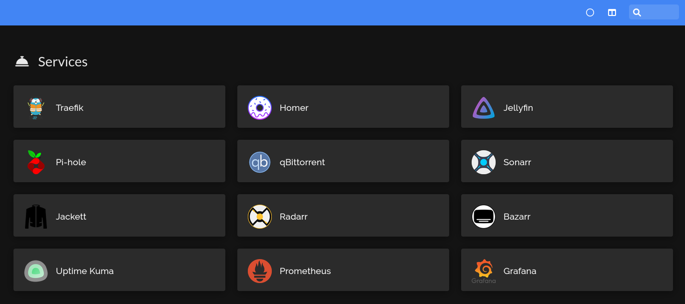

# Homeserver
An ansible playbook to deploy and configure my home server.

This playbook assumes a fresh Raspbian 64-bit install, access to a non-root user with sudo privileges and a public SSH key.

## Hardware
For my server I use a Raspberry Pi 4 Model B with 8GBs of RAM with an attached Geekworm X735 Expansion board and a GeeekPi X825 SATA Expansion board for 1TB of SSD storage.

## Software
My server currently runs Raspbian 64-bit, however this playbook should be compatible with any Debian based OS

### Services
- [Traefik](https://traefik.io/traefik/) - Reverse Proxy
- [Homer](https://github.com/bastienwirtz/homer) - Interactive web dashboard
- [Jellyfin](https://jellyfin.org/) - Media Server
- [Pi-hole](https://pi-hole.net/) - DNS level ad blocker
- [qBittorrent](https://www.qbittorrent.org/) - Torrent client
- [Sonarr](https://sonarr.tv/) - TV Series Manager
- [Jackett](https://github.com/Jackett/Jackett) - Torrent tracker
- [Radarr](https://radarr.video/) - Film Series manager
- [Bazarr](https://www.bazarr.media/) - Subtitles manager
- [Uptime Kuma](https://github.com/louislam/uptime-kuma) - Uptime monitor
- [Prometheus](https://grafana.com/oss/prometheus/) - Systems monitor
- [Grafana](https://grafana.com/) - Metric visualization

### Other
- [x735 Safe shutdown script](https://github.com/thorkseng/x735-v2.5)
- [Samba](https://www.samba.org/samba/)

### Getting Started
See [USAGE.md](./USAGE.md)